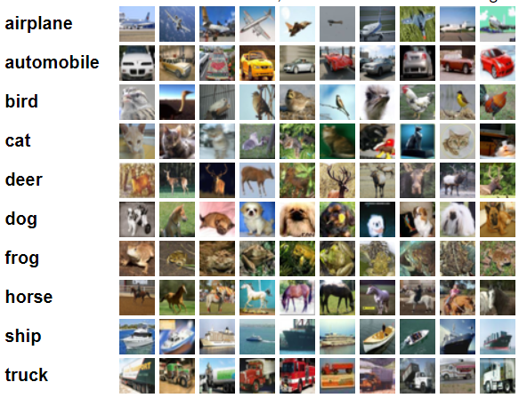

# Convolution Neural Networks in Keras
## Dataset
### CIFAR - 10
CIFAR-10 dataset consists of 60000 32x32 colour images in 10 classes, with 6000 images per class. There are 50000 training images and 10000 test images.

    

Figure: CIFAR-10 Data samples from each class (<a href="https://www.cs.toronto.edu/~kriz/cifar.html">source</a>)

## Experiments
I have conducted following 9 expermients and reported their results in `results` folder.

### Task 01: Base Architecture
This is the base architecture of my keras models.

### Task 02: Batch Normalization in Keras
I added batch normalization layer after every convolution layer in base architecture.

### Task 03: Mean Substraction in Keras
I calculated the mean of dataset and performed mean-subtraction while training this model.

    

Figure: Mean of CIFAR-10 dataset

### Task 04: Initialization Methods in Keras
I tried and evaluated different initialization methods in this task including Random Normal, Truncated Normal and Variance Scaling initialization.

### Task 05: Adding Dropout Layer in Keras
I added the dropout after the dense layer(1024) and also after 4th convolution layer.

### Task 06: Learning Rate and Momentum in Keras
I have reported different learning rates(0.0001 with momentum (0.9), 0.001, 0.01) for Base Architecture and evaluated impacts.

### Task 07: Cross Validation in Keras + scikit-learn
I used k-fold validation to evaluate my model, where k = 3. The data was divided randomly at each fold. Used Sklearn library to perform the task as Keras does not provide any built-in functionality for this purpose.

### Task 08: Optimization Methods in Keras
I have reported 3 different optimization methods in out results. I have used the Adamax, Adam and SGD methods.

### Final Architecture
Configurations for this NN: (​applied all best configurations at a time​) 
    
    ● Batch-Normalization layers 
    ● Dropout layer 
    ● Mean Subtract  
    ● Admax Optimizer 
    ● Variance Scripting Initializer 
